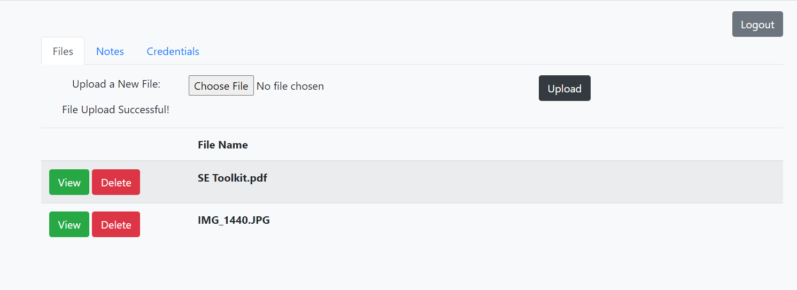

# Super*Duper*Drive Cloud Storage
Super Duper Drive is a storage application that allows users to store files, notes and credentials in the cloud. This project was developed in completing the Udacity Java Developer Nanodegree. 
It was built using Spring Boot framework.

#### Features:
- User Authentication
- Files upload, download and deletion
- Notes creation, update and deletion
- Credentials creation, update and deletion

#### Screenshots:



## Getting Started
### Prerequisites
For building and running the application you need:
1. JDK 11
2. Maven 3

### Key Dependencies
For backend
1. Spring Starter Web
2. MyBatis
3. Spring Security
4. Selenium Java

For frontend
1. Thymeleaf
2. Bootstrap 4

## How to Run
To run the application locally:
- Clone the repository using the following command:
```
git clone https://github.com/<your-git-username>/super-duper-drive-project.git
```

- Run the app by executing the main method in the com.udacity.jwdnd.course1.cloudstorage.CloudStorageApplication class from your IDE or by running:
```  
mvn spring-boot:run
```

## Author
- Chijioke Ibekwe (https://github.com/chijioke-ibekwe)

